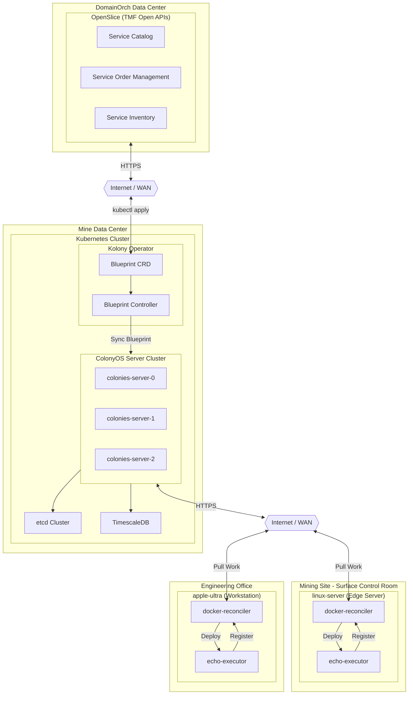
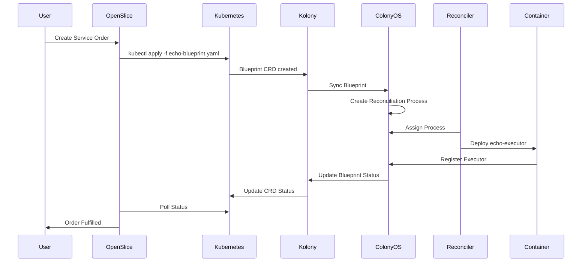

# COP Pilot Demo - OpenSlice Integration with ColonyOS

This demo showcases the integration between OpenSlice and ColonyOS for automated service deployment across heterogeneous infrastructure.

## Use Case: Mining and Industrial Edge Computing

ColonyOS enables unified management of compute resources across vastly different environments - from cloud data centers to remote mining sites. The docker-reconcilers can run on:

- **Embedded devices**: Industrial PCs, PLCs, ruggedized edge computers
- **Edge servers**: On-premise servers at remote locations (mines, offshore platforms)
- **Desktop workstations**: Developer machines, engineering workstations
- **Cloud VMs**: Traditional cloud infrastructure

This allows operators to deploy and manage workloads across an entire mining operation from a single control plane, regardless of whether the target is a sensor gateway in an underground tunnel or a GPU server in the surface data center.

## Architecture Overview



## Components

### OpenSlice
- **Service Catalog**: Defines available services (executor deployments)
- **Service Order Management**: Handles order creation and lifecycle
- **Service Inventory**: Tracks deployed services

### Kubernetes Infrastructure
- **ColonyOS Server Cluster**: 3-node cluster for high availability
- **Kolony Operator**: Kubernetes operator that syncs Blueprint CRDs to ColonyOS
- **etcd**: Distributed key-value store for ColonyOS coordination
- **TimescaleDB**: Time-series database for process history and metrics

### Edge Locations / Mining Sites
The docker-reconcilers run at edge locations and connect back to ColonyOS over the network. They can operate in environments with intermittent connectivity - queuing work when offline and syncing when connection is restored.

- **apple-ultra**: Engineering workstation (macOS/Apple Silicon) - used for development and monitoring
- **linux-server**: Edge server or embedded device (Linux/x86_64) - deployed at remote mining sites, processing plants, or underground infrastructure

In a real mining deployment, these could be:
- Ruggedized industrial PCs in underground tunnels
- Edge servers in surface control rooms
- Sensor gateways collecting telemetry data
- GPU nodes for real-time video analytics

## Demo Flow



## Prerequisites

1. **Kubernetes cluster** with ColonyOS deployed (3 servers)
2. **Kolony operator** installed with CRDs
3. **docker-reconcilers** running at edge locations:
   - `apple-ultra` (locationName: `apple_ultra`)
   - `linux-server` (locationName: `home_linux_server`)
4. **ColonyOS credentials** secret in target namespace
5. **OpenSlice** configured with ColonyOS service specifications

## Blueprint Examples

### Deploy to Linux Server

```yaml
apiVersion: colony.colonyos.io/v1
kind: Blueprint
metadata:
  name: echoexecutor-linux
  namespace: default
spec:
  kind: ExecutorDeployment
  locationName: home_linux_server
  data:
    executorType: echo-executor
    image: colonyos/echoexecutor:v1.0.8
    replicas: 1
    env:
      EXECUTOR_TYPE: echo-executor
      EXECUTOR_HW_PLATFORM: linux
      EXECUTOR_HW_ARCHITECTURE: amd64
```

### Deploy to Apple Ultra

```yaml
apiVersion: colony.colonyos.io/v1
kind: Blueprint
metadata:
  name: echoexecutor-apple
  namespace: default
spec:
  kind: ExecutorDeployment
  locationName: apple_ultra
  data:
    executorType: echo-executor
    image: colonyos/echoexecutor:v1.0.8
    replicas: 1
    env:
      EXECUTOR_TYPE: echo-executor
      EXECUTOR_HW_PLATFORM: darwin
      EXECUTOR_HW_ARCHITECTURE: arm64
```

## Demo Commands

### 1. Verify Infrastructure

```bash
# Check ColonyOS servers
kubectl get pods -n colonies | grep colonies-server

# Check Kolony operator
kubectl get pods -n kolony-system

# Check docker-reconcilers
colonies executor ls
```

### 2. Deploy via kubectl (simulating OpenSlice)

```bash
# Deploy to linux-server
kubectl apply -f echo-blueprint.yaml

# Watch blueprint status
kubectl get blueprints -w

# Verify executor registered
colonies executor ls | grep echo
```

### 3. Test the Deployed Executor

```bash
# Send echo request
colonies function exec --func echo --args "Hello from COP Pilot!" \
  --targettype echo-executor --follow
```

### 4. Cleanup

```bash
# Remove blueprint (triggers cleanup process)
kubectl delete -f echo-blueprint.yaml

# Verify executor removed
colonies executor ls
```

## OpenSlice Integration Points

| TMF API | ColonyOS Mapping |
|---------|------------------|
| TMF633 Service Catalog | BlueprintDefinition |
| TMF641 Service Order | Blueprint CRD (kubectl apply) |
| TMF638 Service Inventory | Blueprint Status + Executor List |
| TMF639 Resource Inventory | Process History + Logs |

## Monitoring

```bash
# Watch blueprint reconciliation
colonies blueprint ls

# View reconciliation logs
colonies log get -e docker-reconciler

# Check process history
colonies process ps
```

## Architecture Benefits

1. **Declarative**: Define desired state, system reconciles automatically
2. **Location-aware**: Route deployments to specific edge locations (mines, plants, tunnels)
3. **Self-healing**: Reconcilers continuously ensure desired state even after network outages
4. **Observable**: Full audit trail via ColonyOS process history
5. **Standards-based**: TMF Open APIs for service management integration
6. **Resilient**: Edge reconcilers work independently during connectivity loss
7. **Heterogeneous**: Manage embedded devices, edge servers, and cloud VMs from one control plane
