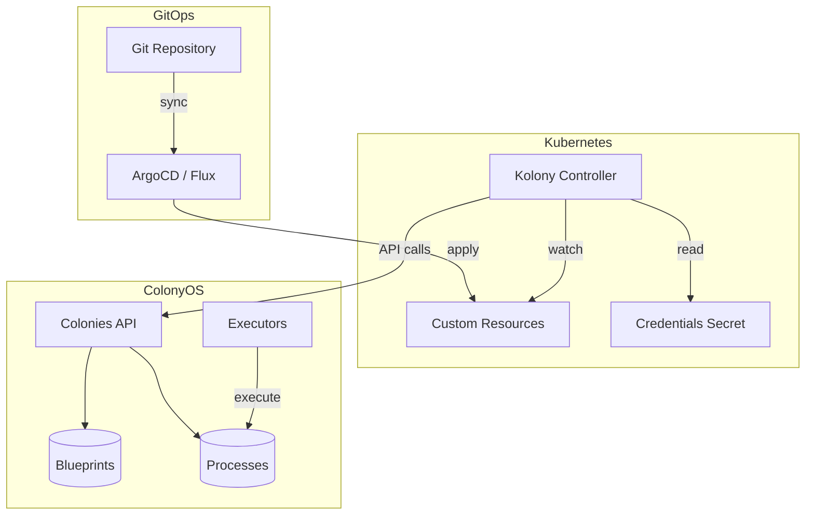
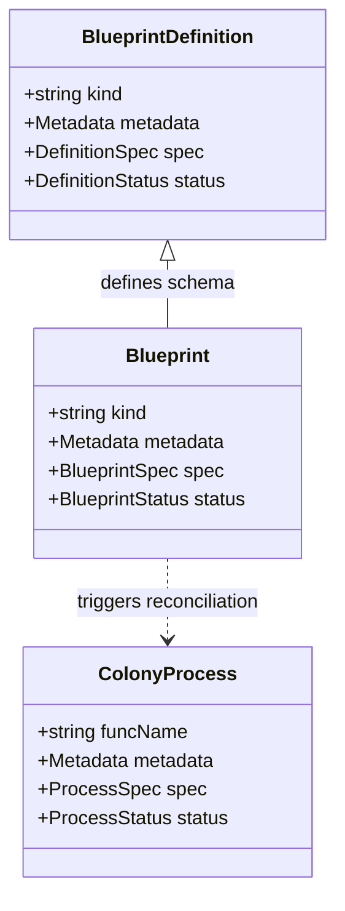
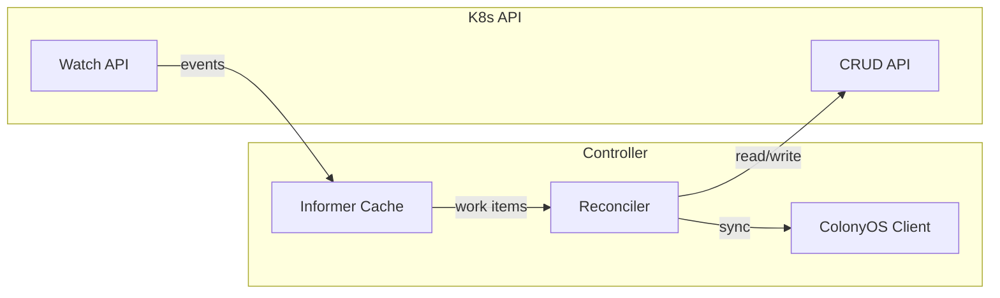
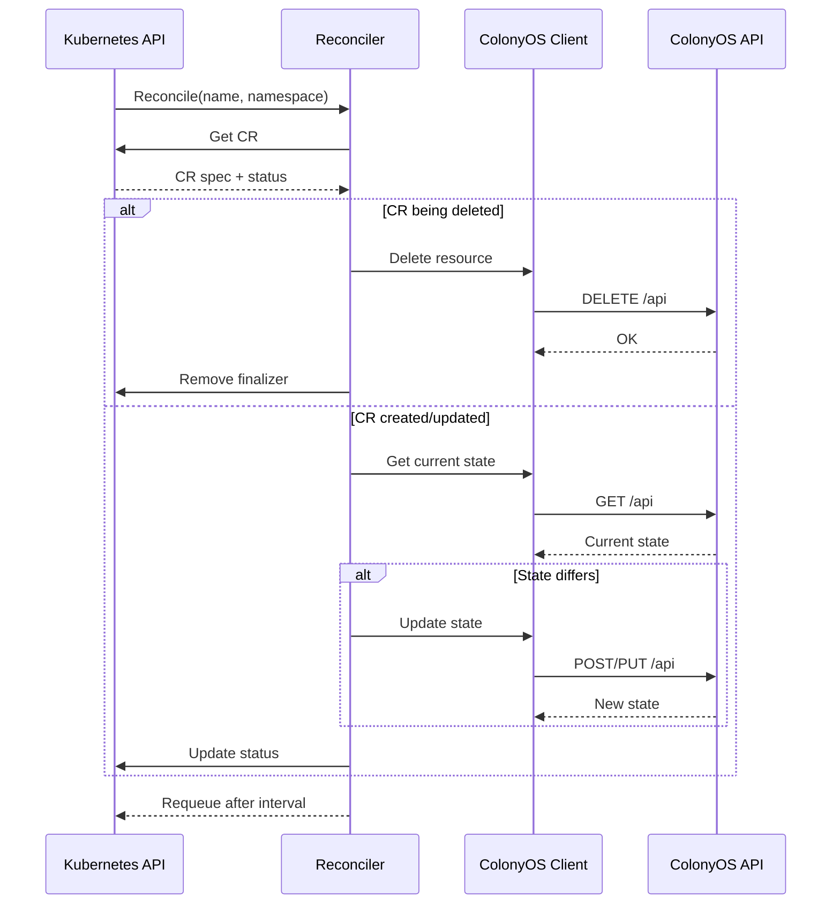
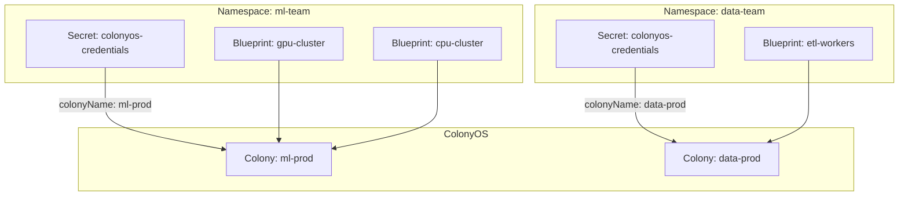
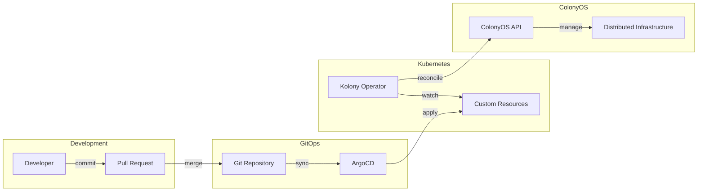
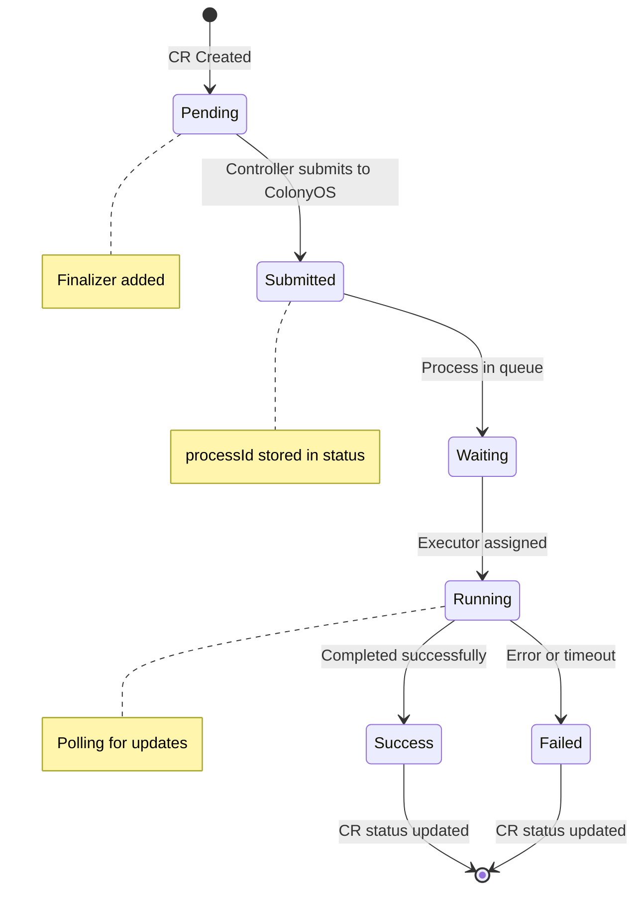
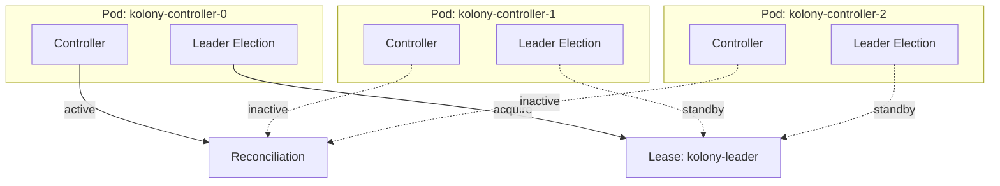
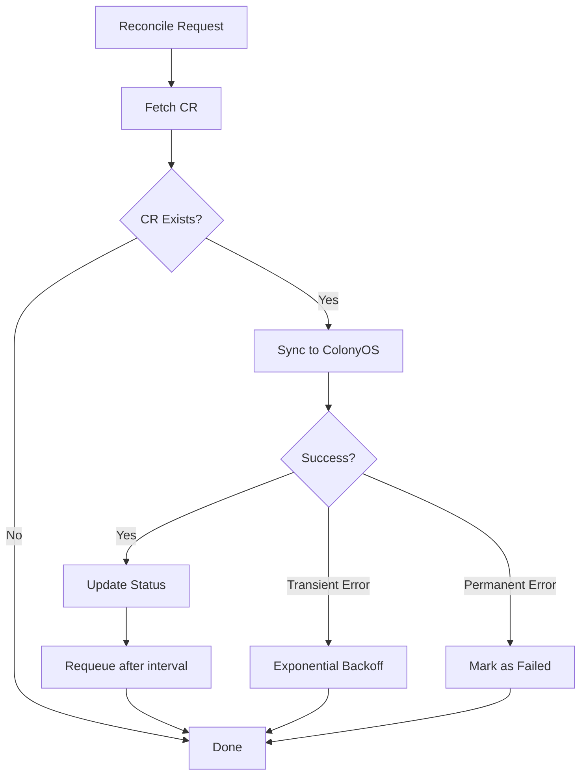

# Kolony Design Document

Kolony is a Kubernetes operator that enables declarative management of ColonyOS resources using Custom Resource Definitions (CRDs). This document describes the architecture, design decisions, and implementation details.

## Overview



## Custom Resource Definitions

Kolony defines three primary CRDs that map to ColonyOS concepts:



### BlueprintDefinition

Defines a schema for a type of blueprint, similar to how a CRD defines a schema for custom resources.

```yaml
apiVersion: colonyos.io/v1
kind: BlueprintDefinition
metadata:
  name: gpu-executor-def
  namespace: ml-team
spec:
  kind: GPUExecutor
  names:
    singular: gpuexecutor
    plural: gpuexecutors
  handler:
    executorType: docker-reconciler
    functionName: reconcile
    reconcileInterval: 60
status:
  definitionId: abc123...
  registered: true
  lastSyncTime: "2026-01-03T10:00:00Z"
```

### Blueprint

An instance of a BlueprintDefinition, representing desired state for a resource.

```yaml
apiVersion: colonyos.io/v1
kind: Blueprint
metadata:
  name: llm-cluster
  namespace: ml-team
spec:
  kind: GPUExecutor
  replicas: 10
  image: colonyos/llm-executor:v2
  resources:
    gpu: 1
    memory: 32Gi
status:
  blueprintId: def456...
  generation: 5
  synced: true
  readyReplicas: 10
  lastReconcileTime: "2026-01-03T10:05:00Z"
```

### ColonyProcess

A job-like resource that submits a function to ColonyOS and tracks its execution.

```yaml
apiVersion: colonyos.io/v1
kind: ColonyProcess
metadata:
  name: train-model-run-42
  namespace: ml-team
spec:
  funcName: train
  executorType: gpu-executor
  args:
    - "--epochs=100"
  kwargs:
    model: gpt-neo
    dataset: s3://bucket/data
  maxWaitTime: 3600
  maxExecTime: 86400
status:
  processId: proc789...
  state: RUNNING
  assignedExecutor: gpu-node-3
  startTime: "2026-01-03T10:00:00Z"
  completionTime: null
  output: []
```

## Controller Architecture



### Reconciliation Loop

Each controller follows the standard Kubernetes reconciliation pattern:



## Namespace and Colony Mapping

Each Kubernetes namespace maps to a ColonyOS colony through a credentials secret:



### Credentials Secret

```yaml
apiVersion: v1
kind: Secret
metadata:
  name: colonyos-credentials
  namespace: ml-team
type: Opaque
data:
  serverHost: c2VydmVyLmNvbG9ueW9zLmlv
  serverPort: NDQz
  tls: dHJ1ZQ==
  colonyName: bWwtcHJvZA==
  colonyPrvKey: <base64-encoded-key>
  executorPrvKey: <base64-encoded-key>
```

## GitOps Integration



### Repository Structure

```
gitops-repo/
├── clusters/
│   └── production/
│       └── ml-team/
│           ├── namespace.yaml
│           ├── credentials.yaml      # SealedSecret
│           ├── definitions/
│           │   └── gpu-executor.yaml
│           └── blueprints/
│               ├── llm-cluster.yaml
│               └── training-cluster.yaml
└── jobs/
    └── ml-team/
        └── train-run-42.yaml
```

## Process Lifecycle



## Leader Election and High Availability



## Error Handling and Retry



## Metrics and Observability

The operator exposes Prometheus metrics:

| Metric | Type | Description |
|--------|------|-------------|
| `kolony_reconcile_total` | Counter | Total reconciliations by resource type and result |
| `kolony_reconcile_duration_seconds` | Histogram | Time spent in reconciliation |
| `kolony_colonyos_requests_total` | Counter | API calls to ColonyOS by method and status |
| `kolony_resources_total` | Gauge | Current count of managed resources by type |
| `kolony_process_state` | Gauge | Current process states (waiting, running, etc.) |

## Future Considerations

### ColonyWorkflow CRD

Support for process graphs as a single resource:

```yaml
apiVersion: colonyos.io/v1
kind: ColonyWorkflow
metadata:
  name: ml-pipeline
spec:
  processes:
    - name: preprocess
      funcName: preprocess
      kwargs:
        input: s3://data/raw
    - name: train
      funcName: train
      dependencies: [preprocess]
    - name: evaluate
      funcName: evaluate
      dependencies: [train]
```

### Webhook Integration

- Validating webhooks for CR validation
- Mutating webhooks for defaults injection
- Conversion webhooks for version upgrades

### Multi-Cluster Support

Federation of ColonyOS resources across multiple Kubernetes clusters with a central ColonyOS control plane.
