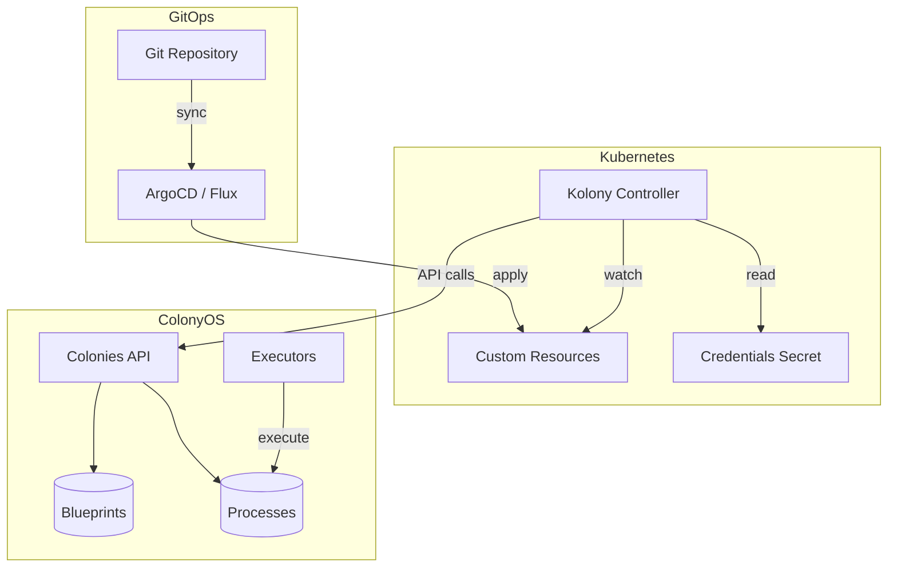
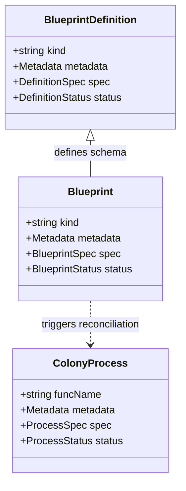
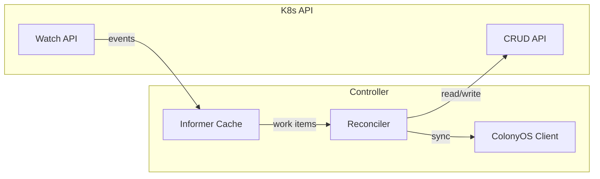
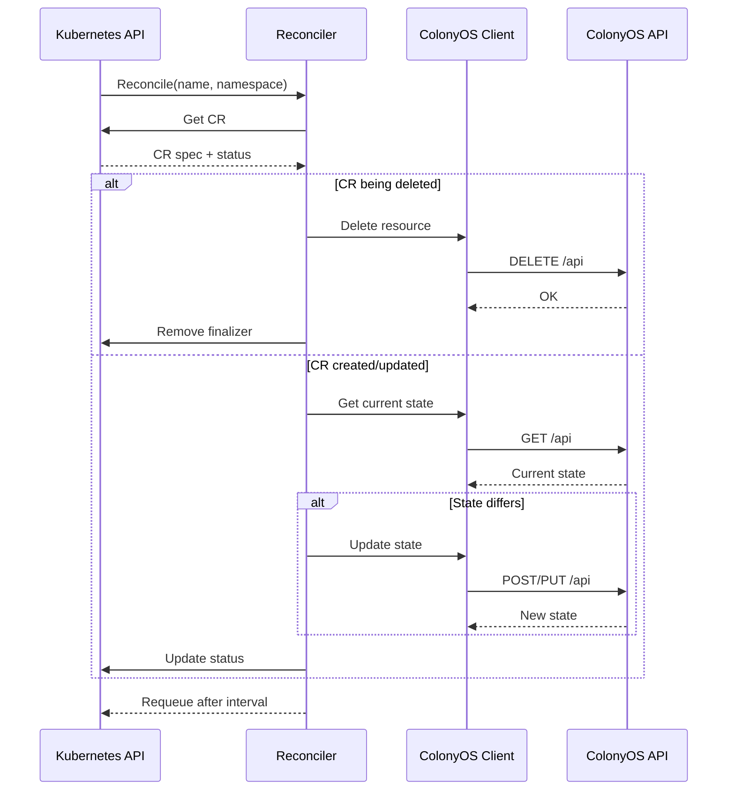
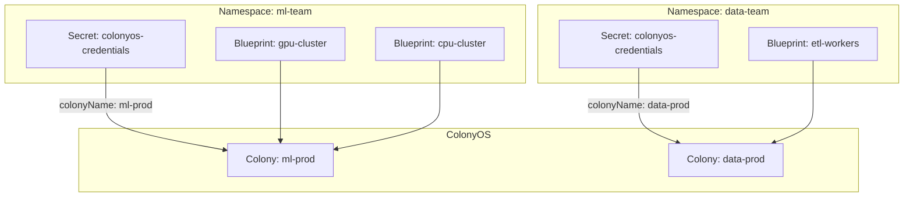
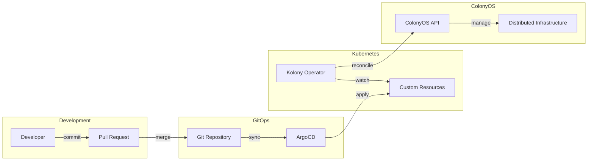
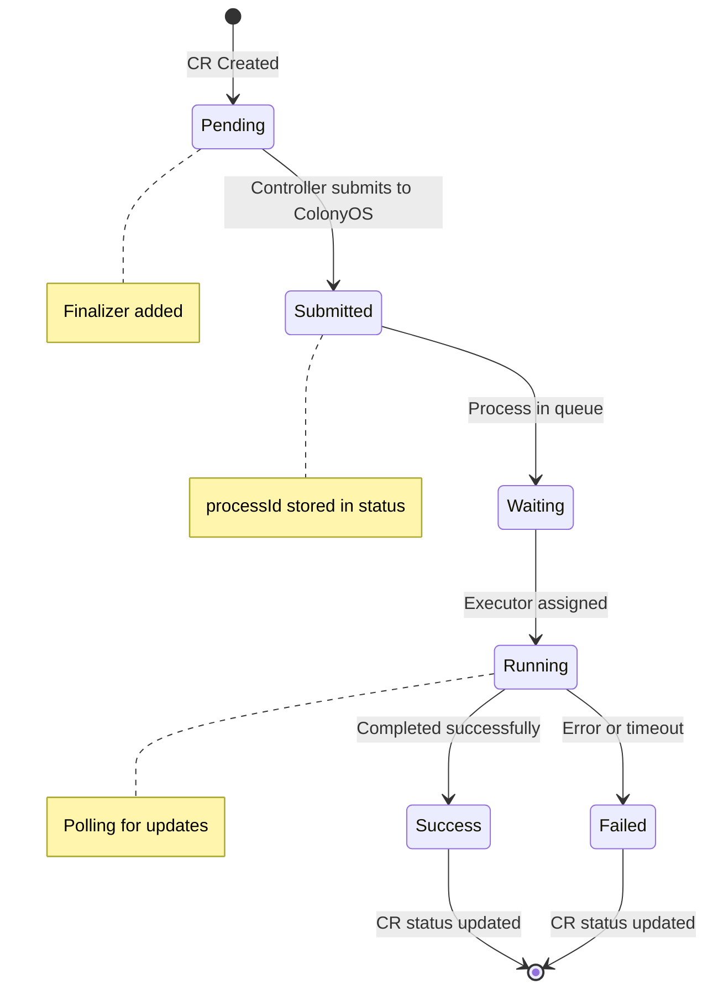
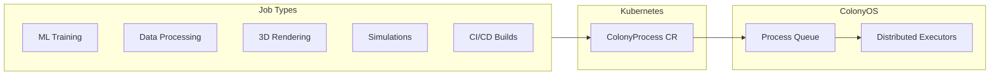
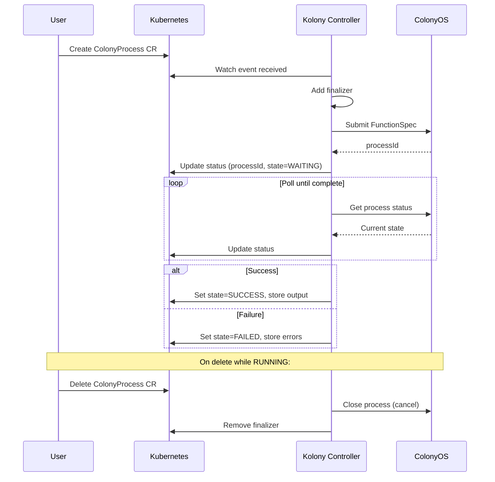
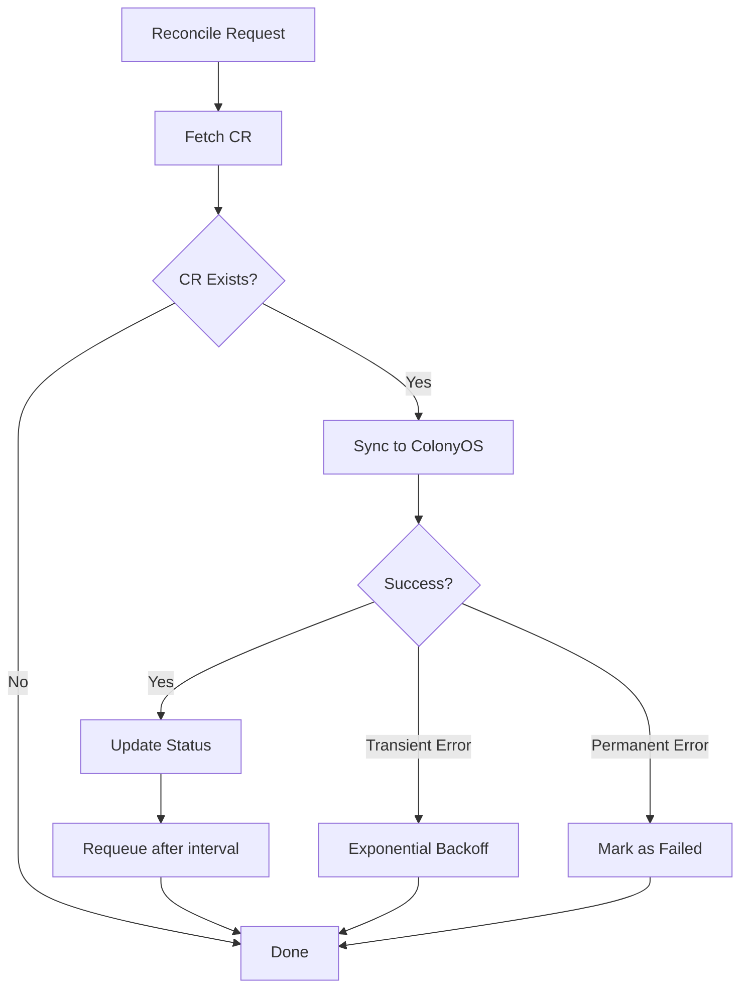

# Kolony Design Document

Kolony is a Kubernetes operator that enables declarative management of ColonyOS resources using Custom Resource Definitions (CRDs). This document describes the architecture, design decisions, and implementation details.

## Overview



## Custom Resource Definitions

Kolony defines three primary CRDs that map to ColonyOS concepts:



### BlueprintDefinition

Defines a schema for a type of blueprint, similar to how a CRD defines a schema for custom resources.

```yaml
apiVersion: colonyos.io/v1
kind: BlueprintDefinition
metadata:
  name: gpu-executor-def
  namespace: ml-team
spec:
  kind: GPUExecutor
  names:
    singular: gpuexecutor
    plural: gpuexecutors
  handler:
    executorType: docker-reconciler
    functionName: reconcile
    reconcileInterval: 60
status:
  definitionId: abc123...
  registered: true
  lastSyncTime: "2026-01-03T10:00:00Z"
```

### Blueprint

An instance of a BlueprintDefinition, representing desired state for a resource.

```yaml
apiVersion: colonyos.io/v1
kind: Blueprint
metadata:
  name: llm-cluster
  namespace: ml-team
spec:
  kind: GPUExecutor
  replicas: 10
  image: colonyos/llm-executor:v2
  resources:
    gpu: 1
    memory: 32Gi
status:
  blueprintId: def456...
  generation: 5
  synced: true
  readyReplicas: 10
  lastReconcileTime: "2026-01-03T10:05:00Z"
```

### ColonyProcess

A job-like resource that submits a function to ColonyOS and tracks its execution.

```yaml
apiVersion: colonyos.io/v1
kind: ColonyProcess
metadata:
  name: train-model-run-42
  namespace: ml-team
spec:
  funcName: train
  executorType: gpu-executor
  args:
    - "--epochs=100"
  kwargs:
    model: gpt-neo
    dataset: s3://bucket/data
  maxWaitTime: 3600
  maxExecTime: 86400
status:
  processId: proc789...
  state: RUNNING
  assignedExecutor: gpu-node-3
  startTime: "2026-01-03T10:00:00Z"
  completionTime: null
  output: []
```

## Controller Architecture



### Reconciliation Loop

Each controller follows the standard Kubernetes reconciliation pattern:



## Namespace and Colony Mapping

Each Kubernetes namespace maps to a ColonyOS colony through a credentials secret:



### Credentials Secret

```yaml
apiVersion: v1
kind: Secret
metadata:
  name: colonyos-credentials
  namespace: ml-team
type: Opaque
data:
  serverHost: c2VydmVyLmNvbG9ueW9zLmlv
  serverPort: NDQz
  tls: dHJ1ZQ==
  colonyName: bWwtcHJvZA==
  colonyPrvKey: <base64-encoded-key>
  executorPrvKey: <base64-encoded-key>
```

## GitOps Integration



### Repository Structure

```
gitops-repo/
├── clusters/
│   └── production/
│       └── ml-team/
│           ├── namespace.yaml
│           ├── credentials.yaml      # SealedSecret
│           ├── definitions/
│           │   └── gpu-executor.yaml
│           └── blueprints/
│               ├── llm-cluster.yaml
│               └── training-cluster.yaml
└── jobs/
    └── ml-team/
        └── train-run-42.yaml
```

## Process Lifecycle



## Submitting FunctionSpecs for Job Processing

The `ColonyProcess` CRD enables submitting any type of job to ColonyOS executors. This provides a Kubernetes-native way to leverage distributed compute resources managed by ColonyOS.

### Use Cases



### FunctionSpec Mapping

The ColonyProcess spec maps directly to a ColonyOS FunctionSpec:

```yaml
apiVersion: colonyos.io/v1
kind: ColonyProcess
metadata:
  name: training-job-001
  namespace: ml-team
spec:
  # Function identification
  funcName: train-model
  executorType: gpu-executor

  # Arguments
  args:
    - "--epochs=100"
    - "--batch-size=32"

  # Keyword arguments (arbitrary key-value pairs)
  kwargs:
    model: resnet50
    dataset: s3://datasets/imagenet
    outputPath: s3://models/resnet50-v2
    hyperparameters:
      learningRate: 0.001
      optimizer: adam

  # Resource requirements
  conditions:
    colonyName: ml-prod
    executorType: gpu-executor
    nodes: 4
    cpu: 8
    memory: 64000      # MB
    gpu:
      count: 2
      name: nvidia-a100

  # Timing constraints
  maxWaitTime: 3600    # Max time in queue (seconds)
  maxExecTime: 86400   # Max execution time (seconds)
  maxRetries: 3

  # Environment
  env:
    CUDA_VISIBLE_DEVICES: "0,1"
    WANDB_API_KEY:
      secretKeyRef:
        name: wandb-credentials
        key: api-key

status:
  processId: "abc123..."
  state: RUNNING
  assignedExecutor: gpu-node-7
  assignedAt: "2026-01-03T10:00:00Z"
  startTime: "2026-01-03T10:00:05Z"
  completionTime: null
  retries: 0
  output: []
  errors: []
```

### Job Patterns

#### One-Shot Job

Submit a single process and wait for completion:

```yaml
apiVersion: colonyos.io/v1
kind: ColonyProcess
metadata:
  name: data-export-$(date +%s)
spec:
  funcName: export-data
  executorType: etl-executor
  kwargs:
    source: postgres://db/analytics
    destination: s3://exports/daily/
    format: parquet
```

#### Batch Processing with Job Arrays

Use Kubernetes Job or a workflow engine to create multiple ColonyProcess resources:

```yaml
# Template for batch processing
apiVersion: colonyos.io/v1
kind: ColonyProcess
metadata:
  name: render-frame-${FRAME_NUMBER}
spec:
  funcName: render
  executorType: render-executor
  kwargs:
    scene: s3://assets/scene.blend
    frame: ${FRAME_NUMBER}
    output: s3://renders/frame-${FRAME_NUMBER}.png
```

#### Long-Running Services

For persistent services, use a Blueprint instead. ColonyProcess is designed for finite jobs.

### Controller Behavior



### Environment Variables from Secrets

Sensitive values can be injected from Kubernetes Secrets:

```yaml
spec:
  env:
    # Direct value
    LOG_LEVEL: debug

    # From Secret
    DATABASE_PASSWORD:
      secretKeyRef:
        name: db-credentials
        key: password

    # From ConfigMap
    CONFIG_FILE:
      configMapKeyRef:
        name: app-config
        key: config.yaml
```

The controller resolves these references before submitting to ColonyOS.

### Output and Artifacts

Process output is captured in the status:

```yaml
status:
  state: SUCCESS
  output:
    - "Training complete"
    - "Accuracy: 0.9542"
    - "Model saved to s3://models/resnet50-v2/model.pt"
  artifacts:
    model: s3://models/resnet50-v2/model.pt
    metrics: s3://models/resnet50-v2/metrics.json
    logs: s3://logs/training-job-001.log
```

### Integration with Argo Workflows

ColonyProcess resources can be created by Argo Workflows for complex pipelines:

```yaml
apiVersion: argoproj.io/v1alpha1
kind: Workflow
metadata:
  name: ml-pipeline
spec:
  entrypoint: train-and-deploy
  templates:
    - name: train-and-deploy
      dag:
        tasks:
          - name: preprocess
            template: colony-job
            arguments:
              parameters:
                - name: funcName
                  value: preprocess

          - name: train
            dependencies: [preprocess]
            template: colony-job
            arguments:
              parameters:
                - name: funcName
                  value: train

    - name: colony-job
      inputs:
        parameters:
          - name: funcName
      resource:
        action: create
        successCondition: status.state == SUCCESS
        failureCondition: status.state == FAILED
        manifest: |
          apiVersion: colonyos.io/v1
          kind: ColonyProcess
          metadata:
            generateName: {{inputs.parameters.funcName}}-
          spec:
            funcName: {{inputs.parameters.funcName}}
            executorType: ml-executor
```

Argo handles DAG orchestration while ColonyOS handles distributed execution across any infrastructure.

## Leader Election and High Availability

Leader election is handled automatically by the Kubernetes `coordination.k8s.io/v1` Lease API. When using controller-runtime, it's a simple configuration option:

```go
mgr, err := ctrl.NewManager(ctrl.GetConfigOrDie(), ctrl.Options{
    LeaderElection:   true,
    LeaderElectionID: "kolony-leader.colonyos.io",
})
```

The framework handles lease acquisition, renewal, graceful handover, and automatic failover. Multiple replicas can run for high availability - only the leader actively reconciles.

## Error Handling and Retry



## Metrics and Observability

The operator exposes Prometheus metrics:

| Metric | Type | Description |
|--------|------|-------------|
| `kolony_reconcile_total` | Counter | Total reconciliations by resource type and result |
| `kolony_reconcile_duration_seconds` | Histogram | Time spent in reconciliation |
| `kolony_colonyos_requests_total` | Counter | API calls to ColonyOS by method and status |
| `kolony_resources_total` | Gauge | Current count of managed resources by type |
| `kolony_process_state` | Gauge | Current process states (waiting, running, etc.) |

## Future Considerations

### ColonyWorkflow CRD

Support for process graphs as a single resource:

```yaml
apiVersion: colonyos.io/v1
kind: ColonyWorkflow
metadata:
  name: ml-pipeline
spec:
  processes:
    - name: preprocess
      funcName: preprocess
      kwargs:
        input: s3://data/raw
    - name: train
      funcName: train
      dependencies: [preprocess]
    - name: evaluate
      funcName: evaluate
      dependencies: [train]
```

### Webhook Integration

- Validating webhooks for CR validation
- Mutating webhooks for defaults injection
- Conversion webhooks for version upgrades

### Multi-Cluster Support

Federation of ColonyOS resources across multiple Kubernetes clusters with a central ColonyOS control plane.
